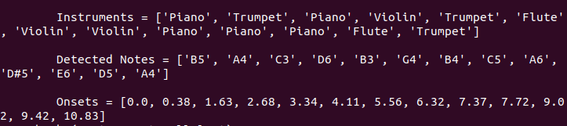

# Mocking-bot

eyantra Robotics competition 2018 - 19 

Jungle safari - Mocking bot

This project has 2 parts mainly: 
- Software part to classify instruments, detect notes and onsets in the audiofile 
- Hardware part to strike the instruments using controllers, servos, motors etc

## Software part:

In this part, musical instrument is classified and their respective notes and onsets are determined using audioprocessing and machine learning principles.

Install the required dependencis:

``` bash 
git clone https://github.com/shiva-raj-km/Mocking-bot

sudo apt-get update
sudo apt-get install libportaudio2 portaudio19-dev
sudo apt-get install python-pip python-dev build-essential git
sudo pip install numpy scipy resampy tensorflow six

cd Mocking-bot/Software/audioset

# Download data files into same directory as code.

curl -O https://storage.googleapis.com/audioset/vggish_model.ckpt
curl -O https://storage.googleapis.com/audioset/vggish_pca_params.npz

# And copy the same to models folder

#Let test it.

python vggish_smoke_test.py

# If it prints "Looks Good To Me", then all is set.

sudo pip install PyAudio
sudo pip install devicehive==2.1.1

# Now make a floder Sound and create four new different folders in it with name flute,piano,Trumpet,violin

mkdir Sound
cd Sound
mkdir flute piano Trumpet violin

# Add the music files in .wav format of respective instruments in their folders

# Now edit the file path in audioset/audio2tfrecord.py file 

# Run

python audio2tfrecord.py

# After it is completed cut and paste all the tfrecord flies from Sound folder into features folder 

mkdir features

# Now let's train the model it will take time to complete, you can see the loss and accuracy values changes as on each step

# Run
python youtube-8m/train.py --train_data_pattern=features/*.tfrecord --num_epochs=100 --learning_rate_decay_examples=40000 --feature_names=audio_embedding --feature_sizes=128 --frame_features --batch_size=64 --num_classes=6 --train_dir=trainlog --base_learning_rate=0.001 --model=LstmModel

# After training is complete a trainlog floder will be created, rename and copy the last three files with extension .meta, .index, .data-00000-of-00001 to youtube_model.ckpt.meta, youtube_model.ckpt.index, youtube_model.ckpt.data-00000-of-00001 respectively to models floder.

# Now run 

python Instrument_classifier.py

# A ouput with three lists of Instrument, note with octave and onsets will be printed of the respective audiofile

# Audio_files folder contains test audio files
```
Libraries used:
Numpy, math, wave, os, struct, pydub, scipy, essentia, pyserial

```bash
pip install numpy essentia scipy pydub pyserial 
```

Results:



This data is transfered to Bot part of the controller using serial communication. As only two instrument is implemented in hardware i.e piano and trumpet the data is filtered and transmitted to Bot part controller.

## Hardware part: 

It has two parts:
-Bot
-Instrument

Bot part has one atmega2560 controller, servos for striking, belt drive system to move the striker. The code for this part is in Hardware/Bot folder and is build in atmel studio 6. Library files which used are all included in the same.

Instrument part has one atmega2560 controller, two instuments build using wood and PVC pipe, to detect the strike capacitive touch sensor is used, SD card is interfaced to play the striked audio note of respective instrument using speaker.


youtube video link: <https://www.youtube.com/watch?v=LIB18VKLttM>

Reference links:
- essentia - audio processing library <https://essentia.upf.edu/documentation/essentia_python_tutorial.html>
- pydub - <https://www.pydoc.io/pypi/pydub-0.9.5/autoapi/audio_segment/index.html>
- scipy wavefile - <https://docs.scipy.org/doc/scipy-0.14.0/reference/generated/scipy.io.wavfile.read.html>
- Standard music notes and their frequencies - <http://pages.mtu.edu/~suits/notefreqs.html>
- Sonic visualizer tool is used to view and analyse the audio file - <https://www.sonicvisualiser.org>

